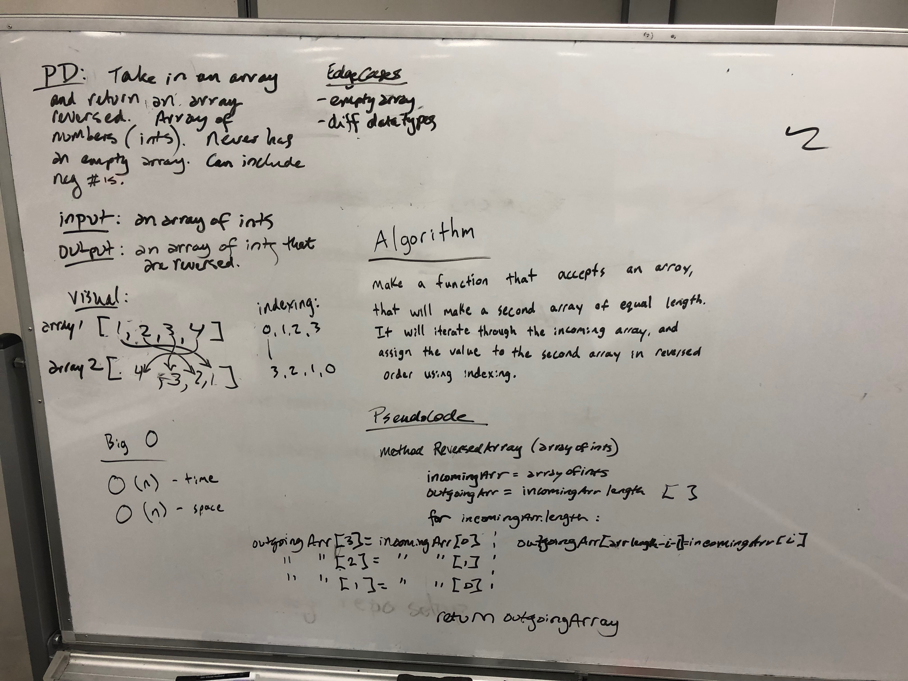
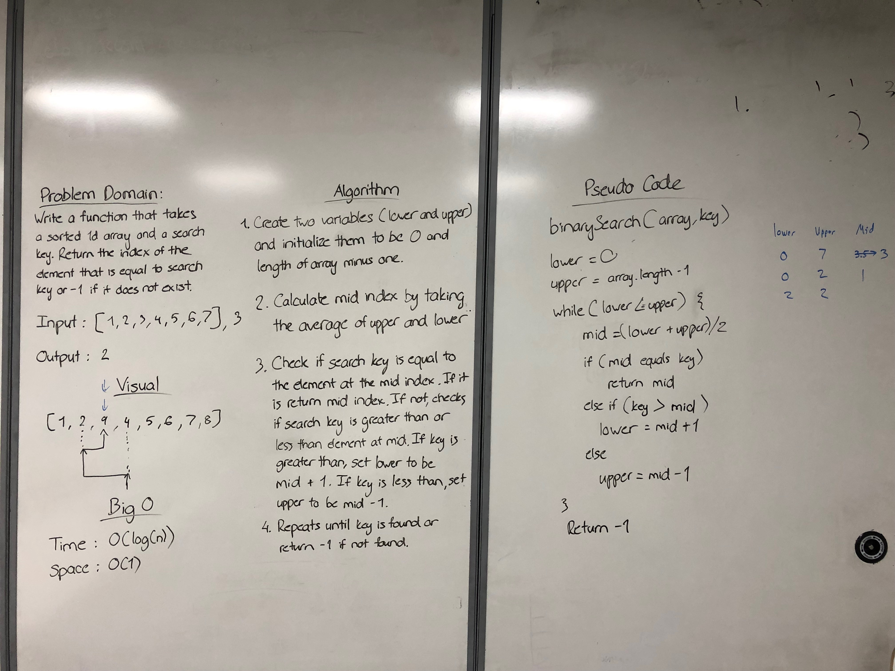
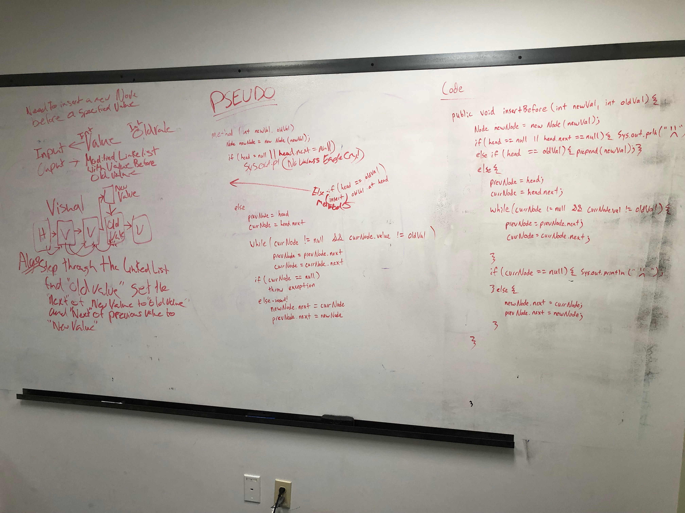
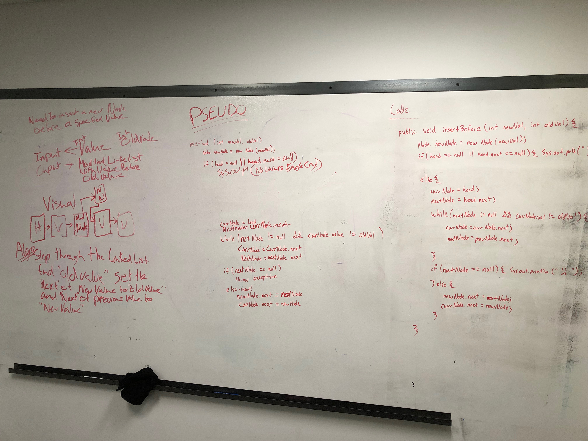

# data-structures-and-algorithms
### Author: James Dansie
This contains the code challenges for code fellows 301 and 401. The code-challenges contains the 301 challenges. code401challenges contains the data structures and algorithms for 401. More detailed READMEs for 401 can be found in code401challenges/src/main/java/code401challenges/assets.

---

### 301
The 301 folder contains;
* 2Darrays
* overall combo
* chaining methods
* filtering arrays
* for-each with arrays
* array.map
* object iteration
* array.reduce
* regex
* regex continued
* array sorting
* string methods
* object value vs reference

---

### 401

* Reverse An Array
* Insert Shift Array
* Binary Search
* Linked List
* Linked List Cont.
* Linked List k from the end
* Linked List Merge
* Stack and Queue
* PseudoQueue

# Reverse an Array
<!-- Short summary or background information -->
This is to make a function that reverses an incoming array of ints.

## Challenge
<!-- Description of the challenge -->
This is to make a function that reverses an incoming array of ints. 

## Approach & Efficiency
<!-- What approach did you take? Why? What is the Big O space/time for this approach? -->
It is O(n) for both time and efficiency because it goes through every element in the array. A replace in-place solution would be faster and use less storage.

## Solution
<!-- Embedded whiteboard image -->

# Insert Shift Array
<!-- Short summary or background information -->
This is to make a function that inserts a new int into an array of ints.

## Challenge
<!-- Description of the challenge -->
This is to make a function that inserts a new int into an array of ints.

## Approach & Efficiency
<!-- What approach did you take? Why? What is the Big O space/time for this approach? -->
It is O(n) for both time and efficiency because it goes through every element in the array. 

## Solution
<!-- Embedded whiteboard image -->

### References
Code at; https://github.com/JamesDansie/data-structures-and-algorithms

# Binary Search
<!-- Short summary or background information -->
This searches for the index of a key in a sorted list.

## Challenge
<!-- Description of the challenge -->
This searches for the index of a key in a sorted list. It will return a -1 if the key is not found.

## Approach & Efficiency
<!-- What approach did you take? Why? What is the Big O space/time for this approach? -->
It is O(log(n)) for performance, and O(1) for storage.

## Solution
<!-- Embedded whiteboard image -->

### References
Code at; https://github.com/JamesDansie/data-structures-and-algorithms

# Linked List

This lab implements a singly linked list. This list includes the methods of contains, insert head, insert tail, and toString. This lab also has jUnit tests for each of the methods. https://www.geeksforgeeks.org/implementing-a-linked-list-in-java-using-class/ is a very helpful guide. This list has been rewritten to not use the static method though. So far only accepts ints into the list.

# Linked Lists Continued
<!-- Short summary or background information -->
This adds two methods for adding nodes at new locations.

### Challenge
<!-- Description of the challenge -->
The methods add a new node either before or after a key. For example; if a list starts as; [1, 2, 3] .insertBefore(2, 10) -> [1, 10, 2, 3]. This inserted a 10 before the key of 2.

### Approach & Efficiency
<!-- What approach did you take? Why? What is the Big O space/time for this approach? -->
It is O(n) for performance, and O(1) for storage.

### Solution
<!-- Embedded whiteboard image -->

# Linked List - k from the end
<!-- Short summary or background information -->
This searches for the value that is "k" units from the end of the linked list.

## Challenge
<!-- Description of the challenge -->
This looks for something that is "k" from the end of the list. However, there are a bunch of cases that could break this, so testing is important.

## Approach & Efficiency
<!-- What approach did you take? Why? What is the Big O space/time for this approach? -->
It is O(n) for performance, and O(1) for storage.

## Solution
<!-- Embedded whiteboard image -->

### References
Code at; https://github.com/JamesDansie/data-structures-and-algorithms

# Linked List - merge
<!-- Short summary or background information -->
Method accepts two linked lists, then merges them together.

## Challenge
<!-- Description of the challenge -->
The method will merge a node from each list every other time. It will also handle lists of different length. Empty lists with throw an exception.

## Approach & Efficiency
<!-- What approach did you take? Why? What is the Big O space/time for this approach? -->
It is O(n) for performance, and O(n) for storage.

## Solution
<!-- Embedded whiteboard image -->

### References
Code at; https://github.com/JamesDansie/data-structures-and-algorithms

# Stack and Queue
This lab implements a generic stack and queue with the necessary testing. The stack has the methods; push, pop, and peek. The queue has the methods; enqueue, dequeue, and peek. Pop, peek, and dequeue will throw exceptions if they are performed on an empty stack or queue.

### References
* Code at; https://github.com/JamesDansie/data-structures-and-algorithms/tree/master/code401challenges/src/main/java/code401challenges/stacksandqueues
* I have seen this before; https://github.com/JamesDansie/CS143/tree/master/csc143/data_structures
* generic node type from; https://stackoverflow.com/questions/19128858/implementing-node-as-a-generic-class

# PseudoQueue
<!-- Short summary or background information -->
Implements a queue using two stacks.

## Challenge
<!-- Description of the challenge -->
The method will make a queue from two stacks. The tricky part is that stacks are LIFO while queues are FIFO. The trick is to have two stacks, so you can use one to reverse the order.

## Approach & Efficiency
<!-- What approach did you take? Why? What is the Big O space/time for this approach? -->
It is O(n) for performance, and O(n) for storage.

## Solution
<!-- Embedded whiteboard image -->

### References
Code at; https://github.com/JamesDansie/data-structures-and-algorithms

