# data-structures-and-algorithms
### Author: James Dansie
This contains the code challenges for code fellows 301 and 401. The code-challenges contains the 301 challenges. code401challenges contains the data structures and algorithms for 401. More detailed READMEs for 401 can be found in code401challenges/src/main/java/code401challenges/assets.

---

### 301
The 301 folder contains;
* 2Darrays
* overall combo
* chaining methods
* filtering arrays
* for-each with arrays
* array.map
* object iteration
* array.reduce
* regex
* regex continued
* array sorting
* string methods
* object value vs reference

---

### 401

* Reverse An Array
* Insert Shift Array
* Binary Search
* Linked List
* Linked List Cont.
* Linked List k from the end
* Linked List Merge
* Stack and Queue
* PseudoQueue
* Animal Shelter
* Multi Bracket Validation
* Binary Tree and BST Tree
* FizzBuzz Tree
* Breadth First Traversal for Tree
* Find Max for Binary Tree
* Hashtables
* Repeated Word
* Tree Intersection

# Reverse an Array
<!-- Short summary or background information -->
This is to make a function that reverses an incoming array of ints.

## Challenge
<!-- Description of the challenge -->
This is to make a function that reverses an incoming array of ints. 

## Approach & Efficiency
<!-- What approach did you take? Why? What is the Big O space/time for this approach? -->
It is O(n) for both time and efficiency because it goes through every element in the array. A replace in-place solution would be faster and use less storage.

## Solution
<!-- Embedded whiteboard image -->

# Insert Shift Array
<!-- Short summary or background information -->
This is to make a function that inserts a new int into an array of ints.

## Challenge
<!-- Description of the challenge -->
This is to make a function that inserts a new int into an array of ints.

## Approach & Efficiency
<!-- What approach did you take? Why? What is the Big O space/time for this approach? -->
It is O(n) for both time and efficiency because it goes through every element in the array. 

## Solution
<!-- Embedded whiteboard image -->
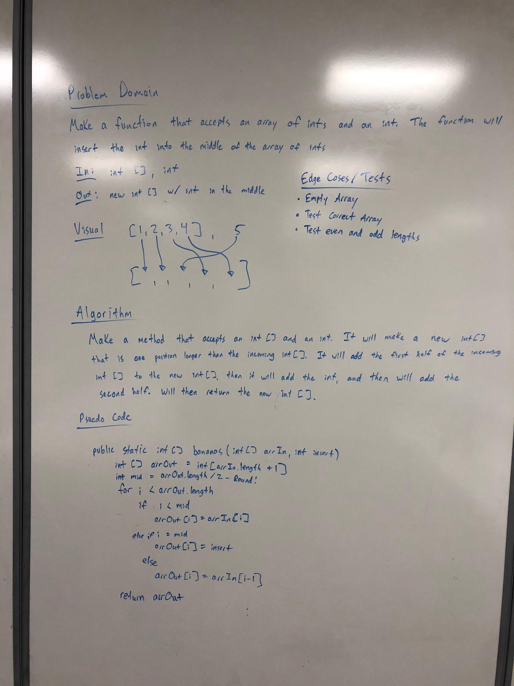

### References
Code at; https://github.com/JamesDansie/data-structures-and-algorithms

# Binary Search
<!-- Short summary or background information -->
This searches for the index of a key in a sorted list.

## Challenge
<!-- Description of the challenge -->
This searches for the index of a key in a sorted list. It will return a -1 if the key is not found.

## Approach & Efficiency
<!-- What approach did you take? Why? What is the Big O space/time for this approach? -->
It is O(log(n)) for performance, and O(1) for storage.

## Solution
<!-- Embedded whiteboard image -->

### References
Code at; https://github.com/JamesDansie/data-structures-and-algorithms

# Linked List

This lab implements a singly linked list. This list includes the methods of contains, insert head, insert tail, and toString. This lab also has jUnit tests for each of the methods. https://www.geeksforgeeks.org/implementing-a-linked-list-in-java-using-class/ is a very helpful guide. This list has been rewritten to not use the static method though. So far only accepts ints into the list.

# Linked Lists Continued
<!-- Short summary or background information -->
This adds two methods for adding nodes at new locations.

### Challenge
<!-- Description of the challenge -->
The methods add a new node either before or after a key. For example; if a list starts as; [1, 2, 3] .insertBefore(2, 10) -> [1, 10, 2, 3]. This inserted a 10 before the key of 2.

### Approach & Efficiency
<!-- What approach did you take? Why? What is the Big O space/time for this approach? -->
It is O(n) for performance, and O(1) for storage.

### Solution
<!-- Embedded whiteboard image -->

# Linked List - k from the end
<!-- Short summary or background information -->
This searches for the value that is "k" units from the end of the linked list.

## Challenge
<!-- Description of the challenge -->
This looks for something that is "k" from the end of the list. However, there are a bunch of cases that could break this, so testing is important.

## Approach & Efficiency
<!-- What approach did you take? Why? What is the Big O space/time for this approach? -->
It is O(n) for performance, and O(1) for storage.

## Solution
<!-- Embedded whiteboard image -->
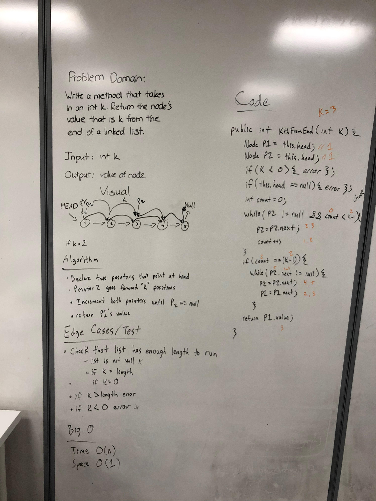

### References
Code at; https://github.com/JamesDansie/data-structures-and-algorithms

# Linked List - merge
<!-- Short summary or background information -->
Method accepts two linked lists, then merges them together.

## Challenge
<!-- Description of the challenge -->
The method will merge a node from each list every other time. It will also handle lists of different length. Empty lists with throw an exception.

## Approach & Efficiency
<!-- What approach did you take? Why? What is the Big O space/time for this approach? -->
It is O(n) for performance, and O(n) for storage.

## Solution
<!-- Embedded whiteboard image -->
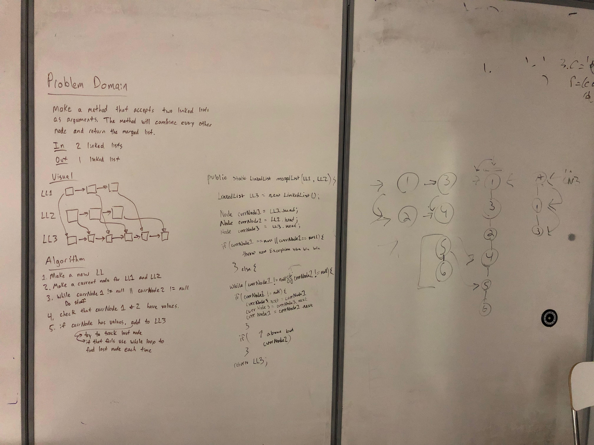

### References
Code at; https://github.com/JamesDansie/data-structures-and-algorithms

# Stack and Queue
This lab implements a generic stack and queue with the necessary testing. The stack has the methods; push, pop, and peek. The queue has the methods; enqueue, dequeue, and peek. Pop, peek, and dequeue will throw exceptions if they are performed on an empty stack or queue.

### References
* Code at; https://github.com/JamesDansie/data-structures-and-algorithms/tree/master/code401challenges/src/main/java/code401challenges/stacksandqueues
* I have seen this before; https://github.com/JamesDansie/CS143/tree/master/csc143/data_structures
* generic node type from; https://stackoverflow.com/questions/19128858/implementing-node-as-a-generic-class

# PseudoQueue
<!-- Short summary or background information -->
Implements a queue using two stacks.

## Challenge
<!-- Description of the challenge -->
The method will make a queue from two stacks. The tricky part is that stacks are LIFO while queues are FIFO. The trick is to have two stacks, so you can use one to reverse the order.

## Approach & Efficiency
<!-- What approach did you take? Why? What is the Big O space/time for this approach? -->
It is O(n) for performance, and O(n) for storage.

## Solution
<!-- Embedded whiteboard image -->
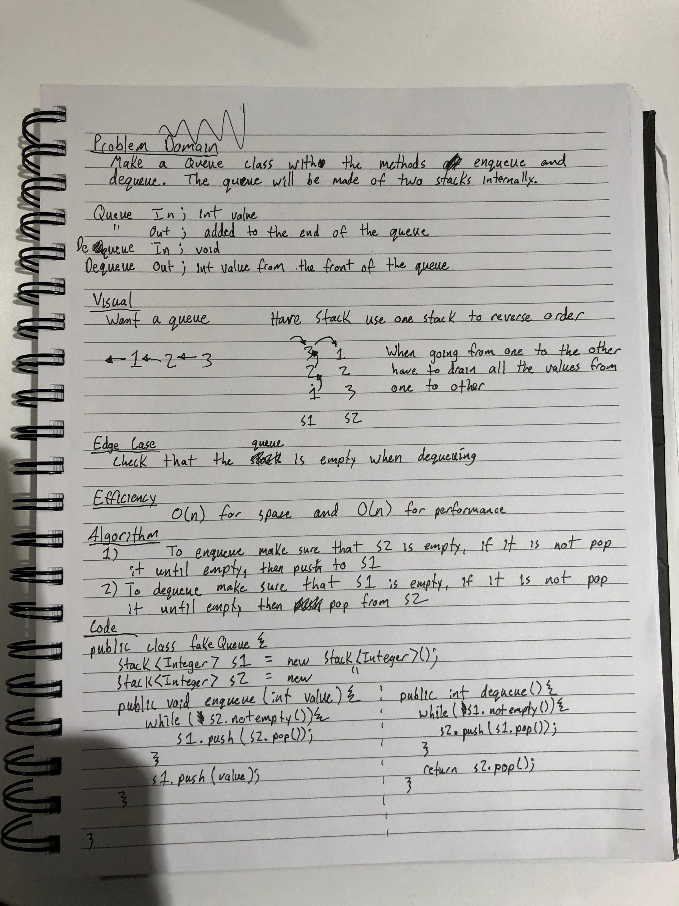

### References
Code at; https://github.com/JamesDansie/data-structures-and-algorithms

# Animal Shelter
<!-- Short summary or background information -->
Make a class of animal shelter that stores cats and dogs with a FIFO method.

## Challenge
<!-- Description of the challenge -->
The class should have an enqueue and dequeue method that accepts and returns two different classes, Cats and Dogs.

## Approach & Efficiency
<!-- What approach did you take? Why? What is the Big O space/time for this approach? -->
It is O(1) for both time and space.

## Solution
<!-- Embedded whiteboard image -->
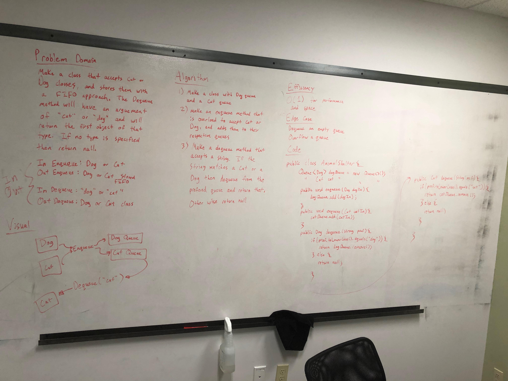

### References
Code at; https://github.com/JamesDansie/data-structures-and-algorithms

# Multi Bracket Validation
<!-- Short summary or background information -->
Make a method that checks if braces are balanced.

## Challenge
<!-- Description of the challenge -->
The method will return a true if (), {}, and [] are balanced. Also need to check the order of the braces, so ({)} would still fail.

## Approach & Efficiency
<!-- What approach did you take? Why? What is the Big O space/time for this approach? -->
The method will loop through the string, and store the opening braces in a stack. When the loop finds a closing brace it will pop the stack, and see it matches. It is O(n) for performance and storage because worse case is that the entire string gets stored in the internal stack.

## Solution
<!-- Embedded whiteboard image -->
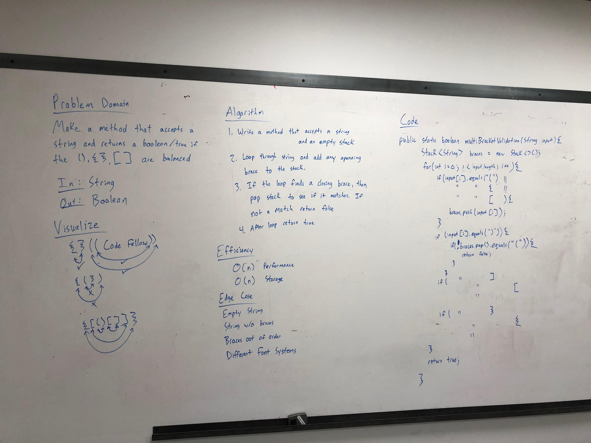

### References
Code at; https://github.com/JamesDansie/data-structures-and-algorithms

# Binary Tree and BST
Implemented binary tree and BST for ints. The binary tree will look for null children, if it doesn't find any then it will pick at random. The BST will sort based on size. Currently no re-balancing methods. All trees have preorder, inorder, and postorder traversals. References;
* https://stackoverflow.com/questions/363681/how-do-i-generate-random-integers-within-a-specific-range-in-java
* https://stackoverflow.com/questions/22927184/trying-to-use-hashmap-to-count-frequency-of-words-in-array
* https://www.baeldung.com/java-binary-tree

# FizzBuzz Tree
<!-- Short summary or background information -->
Make a method that goes through a tree and replaces the values it finds.

## Challenge
<!-- Description of the challenge -->
The method will traverse the tree and replace things that are divisible by 3 with 'Fizz'. It will replace things that are divisible by 5 with 'Buzz'. It will replace things that are divisible by 3 and 5 with 'FizzBuzz'.

## Approach & Efficiency
<!-- What approach did you take? Why? What is the Big O space/time for this approach? -->
The method will do and inOrder traversal. A helper function will check the current value and return the appropriate string. The method will reassign as it goes. It is O(n) for performance (it has to go to every node), and it is O(1) for storage (nothing new is created).

## Solution
<!-- Embedded whiteboard image -->
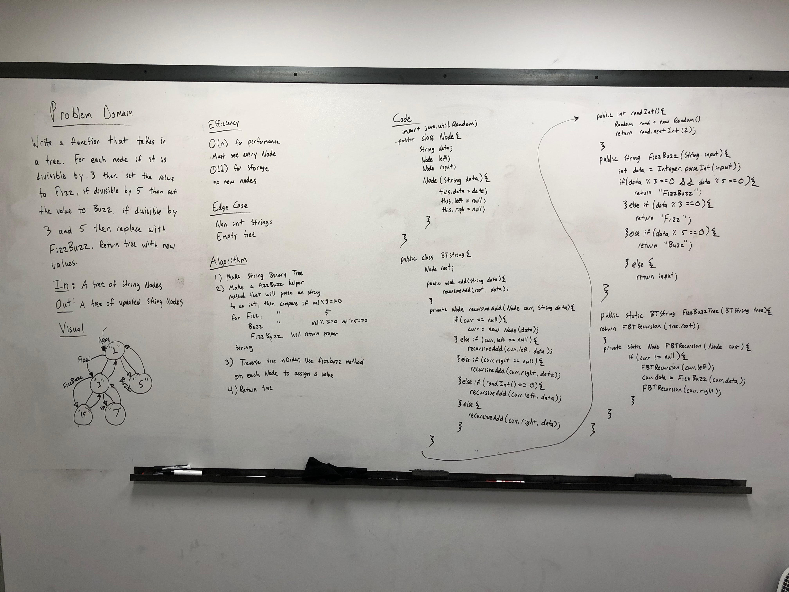

### References
Code at; https://github.com/JamesDansie/data-structures-and-algorithms

# Breadth First Traversal
<!-- Short summary or background information -->
Make a method that prints out a tree using breadth traversal.

## Challenge
<!-- Description of the challenge -->
Make a method that prints out a tree using breadth traversal.

## Approach & Efficiency
<!-- What approach did you take? Why? What is the Big O space/time for this approach? -->
The method will receive a tree. It will then make a queue, and add the root node. It will then dequeue and print the that value. It will then enqueue the left and right of the dequeued node. This way the queue will go through the entire tree.

## Solution
<!-- Embedded whiteboard image -->
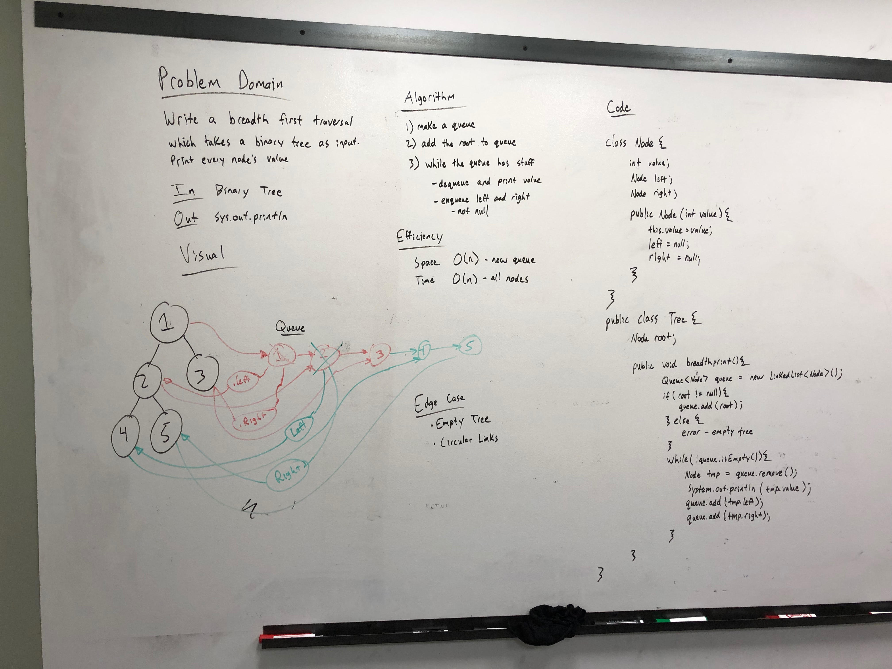

### References
Code at; https://github.com/JamesDansie/data-structures-and-algorithms

# Find Max for Binary Tree
<!-- Short summary or background information -->
Make a method that finds the max value in a binary tree.

## Challenge
<!-- Description of the challenge -->
Make a method that find the max value in a binary tree.

## Approach & Efficiency
<!-- What approach did you take? Why? What is the Big O space/time for this approach? -->
The method will start with the root node and root.data as the max value. It will then move through the tree recursively and compare the current value to the max value. If the current value it greater it will assign that to the max value, and then pass that to the next node. This is O(n) for performance since it will go through every node. It is O(1) for storage since it doesn't store anything.

## Solution
<!-- Embedded whiteboard image -->
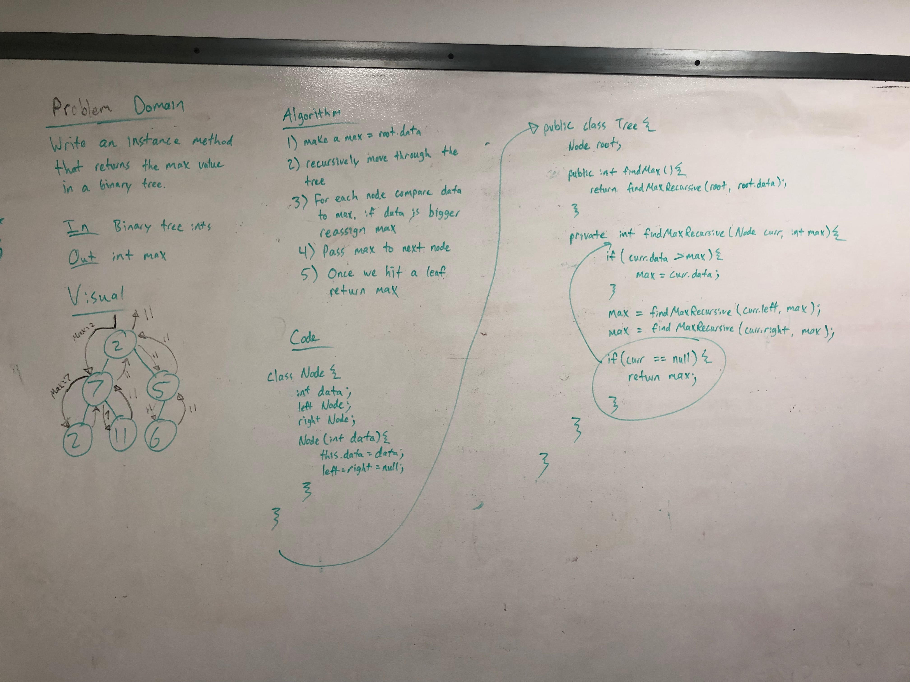

### References
Code at; https://github.com/JamesDansie/data-structures-and-algorithms

# Hashtables
<!-- Short summary or background information -->
Implement a hashtable of strings

## Challenge
<!-- Description of the challenge -->
Hashtables are helpful because they have O(1) for both lookups and additions. It is a trickie data structure since it is an array of linkedlists, and the linkedlists have a type of storage. Storage is a made up class that has a string for key and value.

## Approach & Efficiency
<!-- What approach did you take? Why? What is the Big O space/time for this approach? -->See challenge section above.

## API
<!-- Description of each method publicly available in each of your hashtable -->
* hash takes in key string and returns a hash int
* add takes in a string key and a string value. It will add the strings, and return true if it was successful. It will throw an illegalArgumentException if it finds a duplicate key.
* get takes in a string key and returns the string result. It will send back "Not Found" if it does not find the value.
* contains takes in a String key and returns a true if it finds the value, otherwise it returns a false.

# Repeated Word
<!-- Short summary or background information -->
Write a method that takes in a string, and returns the first repeated word.

## Challenge Description
<!-- Description of the challenge -->
Write a method that takes in a string, and returns the first repeated word.

## Approach & Efficiency
<!-- What approach did you take? Why? What is the Big O space/time for this approach? -->
Use a scanner to read through each word. While the scanner has words left, compare each word to a hash table. If the word is unique (not in the hash table), then add it to the table, otherwise return it.

## Solution
<!-- Embedded whiteboard image -->
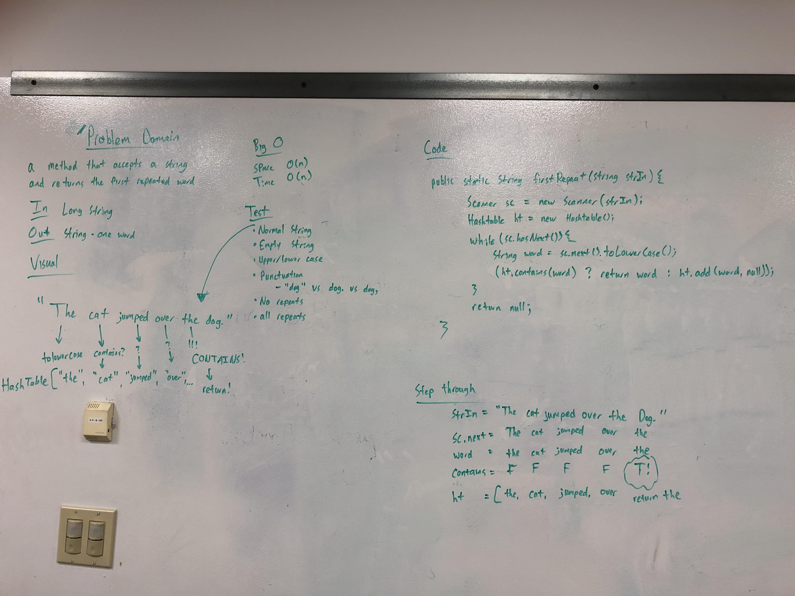

# Tree Intersection
<!-- Short summary or background information -->
Write a method that takes in two binary trees, and returns the values that both trees contain.

## Challenge Description
<!-- Description of the challenge -->
Write a method that takes in two binary trees, and returns the a set of the values that both trees contain.

## Approach & Efficiency
<!-- What approach did you take? Why? What is the Big O space/time for this approach? -->
Recursively got through each tree. In one tree add all the values to a linked list, in the other tree add all the values to a set. The loop through the linked list and see if the value is in the set. If it is then add it to a separate set and return that set.

## Solution
<!-- Embedded whiteboard image -->
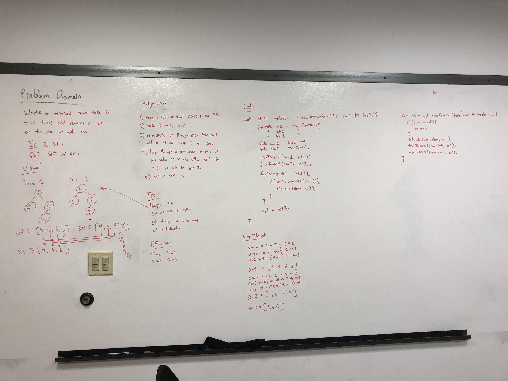

