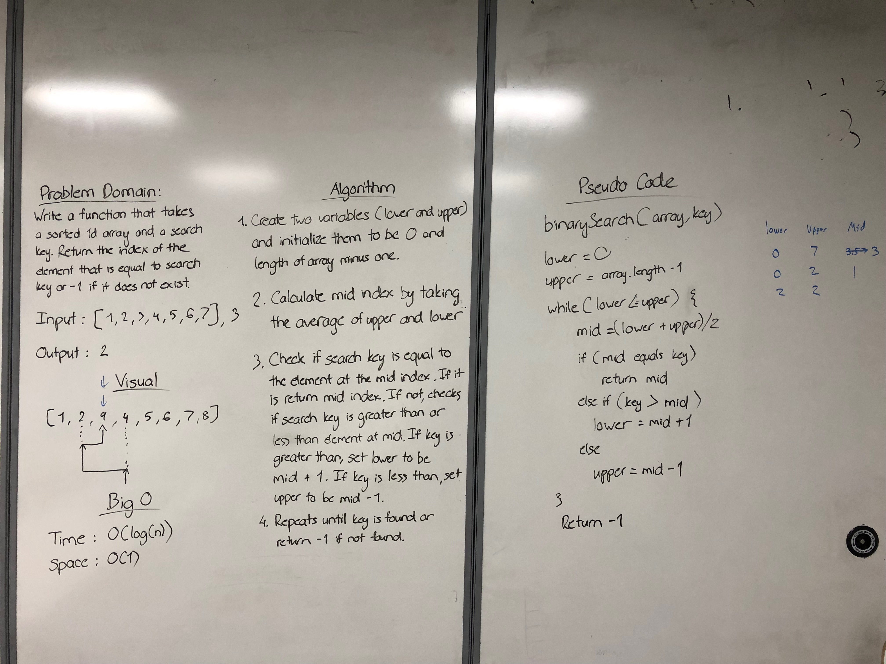

# Binary Search
<!-- Short summary or background information -->
This searches for the index of a key in a sorted list.

## Challenge
<!-- Description of the challenge -->
This searches for the index of a key in a sorted list. It will return a -1 if the key is not found.

## Approach & Efficiency
<!-- What approach did you take? Why? What is the Big O space/time for this approach? -->
It is O(log(n)) for performance, and O(1) for storage.

## Solution
<!-- Embedded whiteboard image -->

### References
Code at; https://github.com/JamesDansie/data-structures-and-algorithms